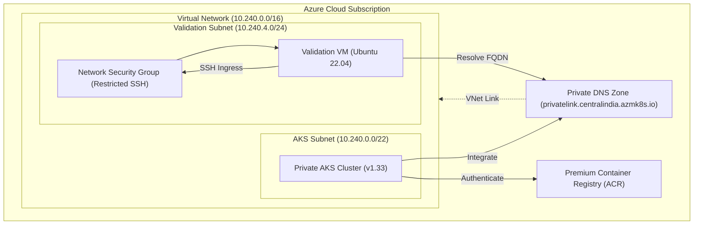

# Enterprise-Grade Private AKS Infrastructure with Terraform

[](https://www.terraform.io/)
[](https://azure.microsoft.com/)
[](#license)

A modular, production-ready Terraform blueprint for deploying a highly secure **Private Azure Kubernetes Service (AKS)** cluster integrated with an **Azure Container Registry (ACR)** and a secure **Validation VM** within a closed Virtual Network topology.

---

## 🏗️ Architecture Design

The architecture enforces the **least exposure** security principle. The AKS API server is completely isolated from the public internet, resolving only via a Private DNS Zone linked to the Virtual Network.



---

## 🌟 Key Features

*   **Closed Network Isolation**: Custom VNet topology dividing workloads into a node subnet (`10.240.0.0/22`) and a validation/management subnet (`10.240.4.0/24`).
*   **Private DNS API Server Integration**: DNS API endpoint resolution inside the VNet using a private DNS link, preventing exposure of control plane endpoints.
*   **Security Hardening**:
    *   Dynamic SSH key loading at runtime using Terraform's `file()` function (no public keys committed to version control).
    *   Ingress network security group (NSG) restricting VM SSH access to trusted IP ranges.
    *   Local credential tracking protected automatically via `.gitignore`.
*   **Enterprise IAM (Managed Identities)**:
    *   Separate Control Plane Identity and Kubelet Identity.
    *   Strict Role-Based Access Control (RBAC): **Network Contributor** on VNet, **Private DNS Zone Contributor** on DNS Zone, and **AcrPull** on ACR.

---

## 📁 Repository Structure

```text
├── artifacts/             # Architecture verification reports & logs
├── modules/               # Reusable infrastructure submodules
│   ├── acr/               # Container Registry module
│   ├── aks/               # Isolated AKS Cluster module
│   ├── dns_zone/          # Private DNS Zone & VNet Link module
│   ├── resource_group/    # Resource Group module
│   ├── role_assignment/   # Generic RBAC Role Assignment module
│   ├── validation_vm/     # Test jumpbox (Validation VM) module
│   └── vnet/              # Subnetting and NSG rules module
├── environments/
│   └── dev/               # Development environment entrypoint
│       ├── main.tf        # Root orchestrator (Module orchestration)
│       ├── variables.tf   # Variable declarations
│       ├── outputs.tf     # CLI Outputs (Private/Public IPs & FQDNs)
│       ├── providers.tf   # Azure/AD Provider configurations
│       ├── versions.tf    # Terraform version locks (~> 1.0)
│       ├── terraform.tfvars.example # Template variables configuration
│       └── terraform.tfvars         # Local configuration (Git-ignored)
└── README.md              # Project documentation
```

---

## 🚀 Getting Started

### 📋 Prerequisites
1.  **Terraform**: Install Terraform `CLI v1.5.0+`.
2.  **Azure CLI**: Installed and authenticated using `az login`.
3.  **SSH Keypair**: A local SSH key stored at `~/.ssh/id_rsa.pub`.

### 1. Configure Local Variables
Clone the variables template and populate it with your local configurations (specifically your SSH public key path and allowed SSH prefix):
```bash
cd environments/dev
cp terraform.tfvars.example terraform.tfvars
```
Open `terraform.tfvars` and verify the values:
```hcl
validation_vm_ssh_public_key_path  = "/home/ubuntu/.ssh/id_rsa.pub"
allowed_ssh_source_address_prefix  = "*" # Replace with your specific office/home IP for optimal security
```

### 2. Initialize and Validate
```bash
terraform init
terraform validate
```

### 3. Plan Deployment
```bash
terraform plan
```

### 4. Deploy Infrastructure
```bash
terraform apply -auto-approve
```

---

## 🧪 Validation & Verification

To verify that the private cluster resolution works correctly inside the closed network:

1.  Locate the **Validation VM Public IP** and **AKS Private FQDN** from the Terraform outputs:
    ```bash
    terraform output validation_vm_public_ip
    terraform output aks_control_plane_fqdn
    ```
2.  SSH into the Validation VM:
    ```bash
    ssh -i ~/.ssh/id_rsa azureuser@<VALIDATION_VM_PUBLIC_IP>
    ```
3.  Test private resolution of your AKS API server endpoint:
    ```bash
    nslookup <AKS_CONTROL_PLANE_FQDN>
    ```
    *Expected output:* The domain resolves to an internal private address (e.g., `10.240.0.4`), proving VNet link and DNS integration are operational.

---

## 🧼 Cleanup

To delete all Azure cloud resources and avoid ongoing billing:
```bash
terraform destroy -auto-approve
```

---

## 📄 License
This project is licensed under the MIT License - see the LICENSE file for details.
